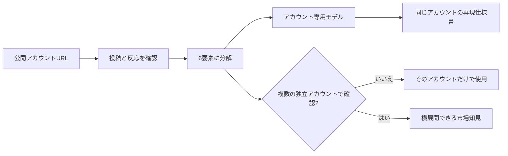

# AI Reel Plugin Marketplace

Instagram Reels、TikTok、YouTube Shortsの公開アカウントを分析し、伸びている動画の仕組みを「企画・台本・映像・音声・字幕・CTA」に分解するCodexプラグインです。

分析結果から、コピーではないオリジナル企画10本、最優先台本、映像・音声仕様、反応予測、検証計画を含む「再現仕様書」を作成できます。歌・音楽が主役の投稿では、オリジナル楽曲と縦型ミュージック動画の制作仕様も作成できます。

> [!IMPORTANT]
> 現在の完成範囲は「URLを入力すると再現仕様書まで出る」です。完成したMP4動画の自動生成は、現時点ではこのプラグインの対象外です。

## このプラグインでできること

- 公開アカウントと投稿の証拠範囲を整理する
- 伸びた投稿と伸びなかった投稿を同一アカウント内で比較する
- フック、台本、映像、音声、字幕、CTAの構造を分析する
- 歌・音楽が主役の投稿を、音楽の役割・歌詞の機能・映像との同期に分解する
- マーケットインとプロダクトアウトの交点を抽出する
- オリジナル企画を10本作る
- 最優先企画の台本、画面テキスト、映像・音声・編集仕様を作る
- 完全オリジナルの歌詞構成、曲調、非特定の日本語合成音声、ミュージック動画のビート設計を作る
- 再生数、いいね、コメント、フォローを低位・基準・高位で条件付き予測する
- 次に検証すべき内容と不足データを整理する
- 分析結果を蓄積し、同じアカウントの再現精度を更新する
- 複数アカウントで確認された特徴だけを、別アカウントへ応用する

## 分析の考え方



学習データは二つの範囲に分けて扱います。

| 範囲 | 必要なアカウント数 | 使用できる場所 |
|---|---:|---|
| アカウント専用モデル | 1アカウント | 同じURL・同じアカウントの再現だけ |
| 横展開用の市場知見 | 原則3つ以上の独立アカウント | 条件が合う別アカウントの企画判断 |

1アカウントから見つかった特徴を、別アカウントの成功法則として自動転用することはありません。

## 最短3ステップで使う

### 1. 準備する

必要なものは次のとおりです。

- CodexデスクトップアプリまたはCodex CLI
- インターネット接続
- 分析したい公開アカウントのURL

このリポジトリは公開されているため、インストールだけならGitHubアカウントやGitの知識は不要です。

### 2. プラグインをインストールする

Codexのターミナルを開き、次の2行を上から順番に実行します。

```powershell
codex plugin marketplace add oinumayu0301/ai-reel-plugin-marketplace --ref main
codex plugin add ai-reel-reproduction-spec@ai-reel-tools
```

インストールできたか確認します。

```powershell
codex plugin list --marketplace ai-reel-tools
```

一覧に次の名前が表示されれば完了です。

```text
ai-reel-reproduction-spec@ai-reel-tools
```

インストール後は、更新内容を確実に読み込むために新しいCodexタスクを開いてください。

### 3. URLを入力して分析する

新しいCodexタスクで、次の文章を送ります。URLだけ自分が分析したいものに変更してください。

```text
$reconstruct-ai-reel-spec

次の公開Instagramアカウントを分析し、伸びる機構を抽出してください。
オリジナル企画10本、最優先台本、映像・音声・字幕仕様、
反応予測、検証計画を含む再現仕様書を作成してください。

URL：https://www.instagram.com/example/
```

## 目的別の使い方

### 1アカウントを分析して再現仕様書を作る

通常はこの使い方から始めます。

```text
$reconstruct-ai-reel-spec

この公開アカウントを分析して、コピーではないオリジナルの再現仕様書を作ってください。
URL：https://www.instagram.com/example/
```

### 歌・音楽が主役の投稿から、オリジナル楽曲仕様を作る

アカウントURLだけでなく、公開リールのURLも入力できます。歌が聞ける・確認できる場合は、音楽が担う役割まで分析します。確認できない場合は、見える情報だけを事実として扱い、音声分析は未確認と明記します。

```text
$reconstruct-ai-reel-spec

この公開リールを分析してください。歌・音楽が伸びに寄与している仕組みを抽出し、
コピーではないオリジナルの歌詞構成、曲調、非特定の日本語AI音声、
縦型ミュージック動画の映像・字幕・CTA仕様を含む再現仕様書を作成してください。

URL：https://www.instagram.com/reel/example/
```

この機能は完成MP3やMP4を自動出力するものではありません。音楽生成サービスへ渡せる制作指示と、制作・投稿時の権利確認を出力する機能です。

### 同じアカウントの専用モデルを更新する

同じアカウントの投稿データを追加し、そのアカウント専用の特徴を蓄積します。

```text
$learn-ai-reel-market

この公開アカウントを取り込み、このアカウント専用の再現モデルを更新してください。
URL：https://www.instagram.com/example/
```

1アカウントだけで実行できます。この結果は、そのアカウントの再現にだけ使用されます。

### 複数アカウントから横展開できる特徴を探す

別アカウントにも応用できる市場知見を作りたい場合に使用します。

```text
$learn-ai-reel-market

次の公開アカウントを比較して市場知能へ追加してください。
フック、台本、映像、音声、字幕、CTAごとに、
複数アカウントで再現している特徴だけを横展開候補にしてください。

URL：https://www.instagram.com/example-a/
URL：https://www.instagram.com/example-b/
URL：https://www.instagram.com/example-c/
```

## URL以外に渡すと精度が上がるデータ

URLだけでも分析を開始できます。次のデータがある場合は、URLと一緒に添付してください。

| 優先度 | データ | 分かるようになること |
|---|---|---|
| 高 | 投稿動画ファイル | 台本、映像、音声、字幕、編集の詳細 |
| 高 | 投稿日と投稿別再生数 | 投稿後の伸び方と比較可能な再生実績 |
| 高 | Instagram Insights | 保持率、シェア、保存、プロフィール遷移、フォロー |
| 中 | いいね数・コメント数 | 反応率とCTAの傾向 |
| 中 | 運用目的・対象者 | 企画と予測の目的適合性 |

取得できない数値はゼロとして扱わず、欠損データとして明記します。非公開指標を事実のように推測することはありません。

## 出力される再現仕様書

主な出力内容は次のとおりです。

1. 証拠範囲、サンプル数、分析信頼度
2. アカウントが伸びている仕組みの要約
3. 伸びた投稿・伸びなかった投稿の比較
4. フック、台本、映像、音声、字幕、CTAの分析
5. マーケットイン／プロダクトアウト分析
6. 転用可能な仕組みとコピーしてはいけない要素
7. オリジナル企画10本と評価
8. 最優先企画の秒単位台本
9. 映像、音声、字幕、編集、書き出し仕様
10. 音楽主役投稿の場合：オリジナル楽曲・日本語合成音声・歌詞表示・映像同期・権利確認仕様
11. 再生、いいね、コメント、フォローの条件付き予測
12. 失敗要因、検証計画、次に必要なデータ

予測は保証値ではありません。利用できる実績データに応じて、低位・基準・高位の範囲と前提条件を示します。

## 保存される学習データ

分析結果は、プラグインを実行した作業フォルダ内の`.ai-reel-intelligence`に保存されます。

```text
.ai-reel-intelligence/
├─ accounts/                 # 正規化された観察データ
├─ account-models/           # 各アカウント専用の再現モデル
├─ intelligence.json         # 複数アカウントを比較した市場知見
├─ learning-report.md        # 人が読むための学習レポート
├─ promotion-queue.json      # 横展開・共通ルールの審査候補
└─ manifest.json             # 取り込み履歴
```

動画本体、完全な台本、音声の生体情報、ログイン情報、Cookie、アクセストークンは学習データへ保存しません。

## プラグインを更新する

GitHub側に新しい変更が公開された場合は、Codexのターミナルで次を実行します。

```powershell
codex plugin marketplace upgrade ai-reel-tools
codex plugin add ai-reel-reproduction-spec@ai-reel-tools
```

更新後は新しいCodexタスクを開いてください。

## プラグインを削除する

```powershell
codex plugin remove ai-reel-reproduction-spec@ai-reel-tools
```

作業フォルダに保存された`.ai-reel-intelligence`は自動削除されません。必要な分析履歴を失わないための仕様です。

## GitHubの見方

GitHubを初めて使う場合は、次の場所だけ分かれば十分です。

| 場所 | 用途 |
|---|---|
| `README.md` | この説明書 |
| `plugins/ai-reel-reproduction-spec` | プラグイン本体 |
| `CHANGELOG.md` | 更新内容 |
| `Issues` | 不具合報告や機能要望 |
| `Code`ボタン | ソースコードのダウンロード |

通常利用では、ソースコードをダウンロードする必要はありません。上記のインストールコマンドを使う方法が最も簡単です。

### ZIPでダウンロードする場合

1. GitHubページ上部の緑色の`Code`ボタンを押す
2. `Download ZIP`を押す
3. ダウンロードしたZIPファイルを展開する

ZIPはソースコードの確認・保管用です。Codexへ導入する場合は、マーケットプレイスのインストールコマンドを使用してください。

## 開発や改善に参加する方法

ここから先は、プラグインを自分で修正したい人向けです。GitHubアカウントとGitが必要です。

1. GitHubでこのリポジトリの`Fork`ボタンを押す
2. 自分のアカウントに作成されたリポジトリをコピーする
3. ターミナルで自分のForkを取得する

```powershell
git clone https://github.com/あなたのGitHubユーザー名/ai-reel-plugin-marketplace.git
cd ai-reel-plugin-marketplace
```

4. 変更用ブランチを作る

```powershell
git switch -c improve/readme-or-analysis
```

5. ファイルを修正し、変更を保存する

```powershell
git add .
git commit -m "改善内容を短く書く"
git push -u origin improve/readme-or-analysis
```

6. GitHubに表示される`Compare & pull request`からPull Requestを送る

パスワード、APIキー、Cookie、アクセストークン、非公開動画はコミットしないでください。

## リポジトリ構成

```text
ai-reel-plugin-marketplace/
├─ .agents/plugins/marketplace.json   # マーケットプレイス定義
├─ plugins/
│  └─ ai-reel-reproduction-spec/
│     ├─ .codex-plugin/plugin.json    # プラグイン情報
│     └─ skills/
│        ├─ reconstruct-ai-reel-spec/ # URLから再現仕様書を作る
│        └─ learn-ai-reel-market/     # 分析結果を蓄積する
├─ CHANGELOG.md
├─ LICENSE
└─ README.md
```

## よくある問題

### `codex`コマンドが見つからない

Codexデスクトップアプリ内のターミナルから実行してください。通常のPowerShellを使う場合は、Codex CLIがインストールされ、パスが通っている必要があります。

### プラグインが一覧に出ない

次を順番に実行し、Codexで新しいタスクを開きます。

```powershell
codex plugin marketplace upgrade ai-reel-tools
codex plugin add ai-reel-reproduction-spec@ai-reel-tools
codex plugin list --marketplace ai-reel-tools
```

### Instagramの投稿を十分に確認できない

非公開アカウント、ログインが必要な投稿、地域・年齢制限、プラットフォーム側の表示制限は回避しません。動画ファイルや投稿別データを利用者自身が提供すると、証拠範囲を補えます。

### URLだけで正確なフォロー数を予測できるか

公開数値だけでは、プロフィール訪問数や投稿別フォロー数が見えない場合があります。その場合は仮定を明示した範囲予測になります。Insightsを提供すると予測の信頼度が上がります。

### 分析すれば必ず動画が伸びるか

保証はできません。企画品質以外にも、投稿時期、初期配信、アカウント状態、競合状況などが影響します。このプラグインは、仮説と証拠を整理し、再現可能な検証を行いやすくするためのものです。

## 安全・権利上の方針

再現対象は、伸びる動画の「仕組み」です。次のものは複製しません。

- 実在クリエイターの人格や本人になりすます表現
- 本人の声の模倣や無断クローン
- キャラクター、台本、映像、音楽、歌詞、メロディー、ジョーク、ショット順の丸ごとコピー
- ログインやアクセス制限の回避
- 取得できない非公開指標の断定

## 公式資料

- [OpenAI公式：プラグインをパッケージ化する](https://developers.openai.com/plugins/build/plugins)
- [OpenAI公式：Skillsの仕組み](https://developers.openai.com/plugins/concepts/skills)

## ライセンス

[MIT License](LICENSE)

## リンク

- [GitHubリポジトリ](https://github.com/oinumayu0301/ai-reel-plugin-marketplace)
- [不具合報告・機能要望](https://github.com/oinumayu0301/ai-reel-plugin-marketplace/issues)
